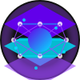

# NyxSynth: The Bioluminescent Neural Blockchain

<div align="center">
  
  <h3>The world's first biomimetic neural cryptocurrency</h3>
  <p>Inspired by deep-sea bioluminescent creatures and powered by adaptive neural networks</p>

  [](https://opensource.org/licenses/MIT)
  [](https://github.com/nyxsynth/nyxsynth/actions/workflows/ci_cd.yml)
  [](docs/SECURITY.md)
  [](https://docs.nyxsynth.com)
</div>

## Overview

NyxSynth is a revolutionary cryptocurrency that combines biomimetic principles from deep-sea creatures with advanced neural networks to create a blockchain that doesn't just process transactions, but actually evolves, adapts, and coordinates like a living ecosystem.

### Key Innovations

1. **Bioluminescent Coordination Protocol (BCP)**: A groundbreaking consensus mechanism inspired by the synchronized light patterns of deep-sea creatures, achieving consensus through coordinated "illumination" patterns between nodes.

2. **Neural Validation Networks**: Transactions are validated through artificial neural networks that adapt to network conditions, creating a self-optimizing blockchain that evolves over time.

3. **Symbiotic Smart Contracts**: Unlike traditional smart contracts that operate in isolation, NyxSynth's contracts form relationships, share resources, and create emergent functionalities.

4. **Quantum-Resistant Security**: Built with post-quantum cryptography from the ground up to ensure long-term security.

5. **Abyssal Scalability**: Dynamic scaling to transaction volumes without compromising security or speed through adaptive neural architecture.

## Getting Started

### Prerequisites

- Python 3.8 or higher
- Node.js 16 or higher
- Docker and Docker Compose (for production deployment)

### Installation Options

#### 1. One-Click Deployment (Recommended)

The simplest way to deploy NyxSynth is using our automated deployment script:

```bash
# Make the script executable
chmod +x scripts/deploy.sh

# Run the deployment script with administrator privileges
sudo ./scripts/deploy.sh
```

The script will:
- Check system requirements
- Install dependencies
- Configure your environment
- Start NyxSynth services

#### 2. Docker Deployment

```bash
# Clone the repository
git clone https://github.com/nyxsynth/nyxsynth.git
cd nyxsynth

# Build and start containers
docker-compose up -d
```

#### 3. Manual Development Setup

```bash
# Clone the repository
git clone https://github.com/nyxsynth/nyxsynth.git
cd nyxsynth

# Set up Python environment
python -m venv venv
source venv/bin/activate  # On Windows: venv\Scripts\activate
pip install -r requirements.txt

# Initialize blockchain
python scripts/initialize.py

# Set up frontend
cd frontend
npm install

# Start the backend
cd ..
python api/secured_server.py

# In a new terminal, start the frontend
cd frontend
npm start
```

### Creating a Wallet

1. Open the NyxSynth web interface
2. Click "Create Wallet" and follow the instructions
3. Store your private key securely - it cannot be recovered if lost!

### Using Neural Staking

1. Navigate to the "Staking" section in the interface
2. Choose a neural pool based on your preferred involvement level
3. Stake your NYX tokens to earn rewards while supporting the network

## Architecture

NyxSynth's architecture consists of several core components that work together to create a living blockchain ecosystem:

```
┌────────────────────────────────────────────┐
│                  Frontend                  │
└───────────────────────┬────────────────────┘
                        │
┌───────────────────────▼────────────────────┐
│                 Secured API                │
└─┬──────────────┬───────────────┬───────────┘
  │              │               │
┌─▼──────────┐ ┌─▼──────────┐ ┌─▼──────────┐
│ Blockchain │ │  Contracts │ │ Neural Net │
└─┬──────────┘ └─┬──────────┘ └─┬──────────┘
  │              │               │
┌─▼──────────────▼───────────────▼──────────┐
│       Bioluminescent Consensus Layer      │
└────────────────────────────────────────────┘
```

### Key Components

- **Blockchain Core**: Implements the fundamental blockchain structure with blocks, transactions, and chain management.
- **Neural Validator**: Processes transactions through neural networks that adapt and evolve over time.
- **Bioluminescent Coordinator**: Manages the consensus mechanism inspired by deep-sea creatures' light patterns.
- **Symbiotic Contracts**: Smart contracts that can form relationships and share resources.
- **Quantum-Resistant Crypto**: Advanced cryptographic systems designed to resist quantum computing attacks.
- **Secured API**: Provides a secure interface for interacting with the blockchain.
- **Frontend Interface**: User-friendly interface for accessing all NyxSynth features.

## Development

### Project Structure

```
nyxsynth/
├── api/                 # API server and endpoints
├── blockchain/          # Core blockchain implementation
│   ├── core.py          # Blockchain data structures
│   ├── consensus/       # Bioluminescent consensus
│   ├── crypto/          # Quantum-resistant cryptography
│   └── neural/          # Neural validation network
├── contracts/           # Symbiotic smart contracts
├── frontend/            # React-based user interface
├── scripts/             # Utility and deployment scripts
├── tests/               # Test suites
└── docs/                # Documentation
```

### Running Tests

```bash
# Run core blockchain tests
python -m unittest tests/test_core.py

# Run integration tests
python tests/integration_tests.py

# Run complete test suite including API tests
python tests/integration_tests.py --api --e2e
```

### Contributing

We welcome contributions to NyxSynth! Please see our [Contributing Guidelines](CONTRIBUTING.md) for details on how to submit pull requests, report issues, and suggest improvements.

## Documentation

- [API Reference](docs/API.md) - Detailed API documentation
- [Security Audit](docs/SECURITY.md) - Security audit and hardening guide
- [Architecture Guide](docs/ARCHITECTURE.md) - In-depth architecture explanation
- [Neural Components](docs/NEURAL.md) - Details on neural validation and consensus
- [Contract System](docs/CONTRACTS.md) - Guide to symbiotic smart contracts
- [Deployment Guide](docs/DEPLOYMENT.md) - Production deployment instructions

## Token Economics

- **Total Supply**: 808 million NYX
- **Token Model**: Deflationary with automatic burning (0.5% per transaction)
- **Distribution**: 
  - 42% Neural Staking Rewards
  - 30% Ecosystem Development
  - 15% Core Team & Research
  - 13% Community Growth
- **Unique Feature**: Quarterly halvings (versus the typical 4-year Bitcoin model)

## Security

Security is our top priority at NyxSynth. Key security features include:

- Post-quantum cryptographic algorithms
- Byzantine fault-tolerant consensus
- Formal verification for neural patterns
- Comprehensive transaction validation
- Secure API design with rate limiting and input validation

For a detailed security analysis, please see our [Security Audit and Hardening Guide](docs/SECURITY.md).

## Roadmap

### Genesis Lumination (Q2 2025)
- Launch of testnet
- Initial implementation of Bioluminescent Coordination Protocol
- Neural validator nodes

### Abyssal Deployment (Q4 2025)
- Mainnet launch
- Full neural consensus implementation
- First generation of symbiotic smart contracts

### Evolutionary Substrate (Q2 2026)
- Introduction of self-modifying protocols
- Adaptation to network conditions
- Optimization for efficiency without hard forks

### Deep Integration (Q1 2027)
- Cross-chain neural bridges
- Quantum-resistant security layer
- Enterprise adoption features

## Community

- [Website](https://nyxsynth.com)
- [GitHub](https://github.com/nyxsynth/nyxsynth)
- [Discord](https://discord.gg/nyxsynth)
- [Twitter](https://twitter.com/nyxsynth)

## FAQ

### What makes NyxSynth different from other blockchains?
NyxSynth is the first blockchain to implement biomimetic principles from deep-sea creatures, creating a living ecosystem rather than just a transaction ledger. The neural validation networks and bioluminescent consensus provide unprecedented energy efficiency and adaptability.

### How does the Bioluminescent Coordination Protocol work?
BCP uses synchronized patterns between nodes, similar to how deep-sea creatures coordinate through light signals. Instead of competing through computational power, nodes collaboratively establish consensus through pattern matching and neural validation.

### What are the benefits of Neural Validation?
Neural validation provides enhanced security, efficient scaling, and continuous improvement. The network learns from transaction patterns, adapts to threats, and optimizes performance without requiring manual updates.

### How do Symbiotic Smart Contracts benefit developers?
Developers can create contracts that work together in ways traditional contracts cannot. This enables more complex applications, efficient resource usage, and emergent functionality that evolves over time.

## License

NyxSynth is released under the [MIT License](LICENSE).

## Acknowledgments

We would like to thank the researchers studying deep-sea bioluminescent creatures and neural networks whose work has inspired this project.

---

<div align="center">
  <p>NyxSynth © 2025 - The Biomimetic Neural Cryptocurrency</p>
</div>
